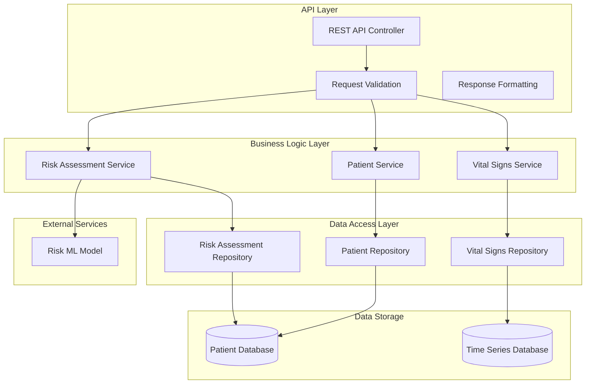

# Design Document: Patient Risk Classifier Backend

## Overview

The Patient Risk Classifier Backend is a RESTful API system that manages patient vital signs data and provides real-time risk assessment using a pre-trained machine learning model. The system follows a microservices architecture with clear separation between data management, risk assessment, and API layers. It stores time-series vital signs data efficiently and provides fast access to current and historical patient information for clinical decision-making.

The system integrates with an existing ML model that takes patient vital signs and clinical parameters as input and returns both a numerical risk score and a boolean risk flag. All patient data is stored persistently with full audit trails and timestamp tracking.

## Architecture

The system follows a layered architecture pattern:



**Key Architectural Decisions:**
- **RESTful API Design**: Standard HTTP methods for CRUD operations
- **Time Series Storage**: Optimized for frequent vital signs updates
- **Separation of Concerns**: Clear boundaries between data, business logic, and presentation
- **External Model Integration**: Loose coupling with ML model service
- **Data Validation**: Multi-layer validation for data integrity

## Components and Interfaces

### API Controller Layer

**PatientController**
- `POST /patients` - Register new patient with initial data
- `GET /patients/{id}` - Retrieve current patient status
- `GET /patients/{id}/history` - Get historical vital signs and risk data
- `PUT /patients/{id}/vitals` - Update patient vital signs
- `GET /patients/high-risk` - Query patients by risk level

**Request/Response Models:**
```json
// Patient Registration Request
{
  "patientId": "string",
  "arrivalMode": "Ambulance|Walk-in",
  "acuityLevel": 1-5,
  "initialVitals": {
    "heartRate": "number",
    "systolicBP": "number", 
    "diastolicBP": "number",
    "respiratoryRate": "number",
    "oxygenSaturation": "number",
    "temperature": "number",
    "timestamp": "ISO8601"
  }
}

// Vital Signs Update Request
{
  "heartRate": "number",
  "systolicBP": "number",
  "diastolicBP": "number", 
  "respiratoryRate": "number",
  "oxygenSaturation": "number",
  "temperature": "number"
}

// Patient Status Response
{
  "patientId": "string",
  "arrivalMode": "string",
  "acuityLevel": "number",
  "currentVitals": "VitalSigns",
  "currentRisk": {
    "riskScore": "number",
    "riskFlag": "boolean",
    "assessmentTime": "ISO8601"
  },
  "lastUpdated": "ISO8601"
}
```

### Business Logic Layer

**PatientService**
- Patient registration and validation
- Patient data retrieval and management
- Business rule enforcement

**VitalSignsService** 
- Vital signs validation against medical ranges
- Time-series data management
- Historical data queries

**RiskAssessmentService**
- Integration with ML risk model
- Risk calculation orchestration
- Risk history tracking

### Data Access Layer

**PatientRepository**
- CRUD operations for patient records
- Patient lookup and search functionality

**VitalSignsRepository**
- Time-series storage and retrieval
- Efficient querying of historical data
- Data compression and archival

**RiskAssessmentRepository**
- Risk assessment storage
- Risk-based patient queries
- Assessment history management

### External Integrations

**Risk Model Interface**
```json
// Model Input Format
{
  "heartRate": "number",
  "systolicBP": "number",
  "diastolicBP": "number",
  "respiratoryRate": "number", 
  "oxygenSaturation": "number",
  "temperature": "number",
  "arrivalMode": "string",
  "acuityLevel": "number"
}

// Model Output Format
{
  "riskScore": "number",
  "riskFlag": "boolean"
}
```

## Data Models

### Patient Entity
```
Patient {
  patientId: String (Primary Key)
  arrivalMode: Enum (Ambulance, Walk-in)
  acuityLevel: Integer (1-5)
  registrationTime: Timestamp
  lastUpdated: Timestamp
}
```

### VitalSigns Entity (Time Series)
```
VitalSigns {
  id: UUID (Primary Key)
  patientId: String (Foreign Key)
  heartRate: Float (60-200 bpm)
  systolicBP: Float (70-250 mmHg)
  diastolicBP: Float (40-150 mmHg)
  respiratoryRate: Float (8-40 breaths/min)
  oxygenSaturation: Float (70-100%)
  temperature: Float (32-42°C)
  timestamp: Timestamp
  recordedBy: String
}
```

### RiskAssessment Entity
```
RiskAssessment {
  id: UUID (Primary Key)
  patientId: String (Foreign Key)
  vitalSignsId: UUID (Foreign Key)
  riskScore: Float
  riskFlag: Boolean
  assessmentTime: Timestamp
  modelVersion: String
}
```

**Data Validation Ranges:**
Based on medical standards research, the system validates:
- Heart Rate: 30-200 bpm (extended range for critical cases)
- Systolic BP: 50-300 mmHg (extended range for critical cases)
- Diastolic BP: 20-200 mmHg (extended range for critical cases)
- Respiratory Rate: 5-60 breaths/min (extended range for critical cases)
- Oxygen Saturation: 50-100% (extended range for critical cases)
- Temperature: 30-45°C (extended range for critical cases)

## Correctness Properties

*A property is a characteristic or behavior that should hold true across all valid executions of a system-essentially, a formal statement about what the system should do. Properties serve as the bridge between human-readable specifications and machine-verifiable correctness guarantees.*

After analyzing the acceptance criteria, I've identified the following testable properties. Some redundant properties have been consolidated to avoid duplication while maintaining comprehensive coverage:

### Property 1: Patient Registration Round Trip
*For any* valid patient registration data (patient ID, arrival mode, acuity level, and initial vital signs), registering the patient and then retrieving it should return exactly the same data
**Validates: Requirements 1.1, 1.2**

### Property 2: Patient ID Uniqueness
*For any* set of patient registrations, all assigned patient IDs should be unique across the system
**Validates: Requirements 1.4**

### Property 3: Registration Triggers Risk Assessment
*For any* patient registration with valid data, the system should automatically create a risk assessment record linked to that patient
**Validates: Requirements 1.3**

### Property 4: Invalid Data Rejection
*For any* vital signs data outside medically acceptable ranges, the system should reject the data and return descriptive error messages
**Validates: Requirements 1.5, 2.1, 6.1**

### Property 5: Vital Signs Storage with Timestamps
*For any* valid vital signs update, the system should store the measurements with accurate timestamps and maintain chronological order
**Validates: Requirements 2.2, 2.4**

### Property 6: Vital Signs Update Triggers Risk Assessment
*For any* vital signs update for an existing patient, the system should automatically create a new risk assessment using the updated data
**Validates: Requirements 2.3**

### Property 7: Data Integrity Under Invalid Updates
*For any* invalid vital signs update attempt, the system should preserve all previous valid measurements unchanged
**Validates: Requirements 2.5**

### Property 8: Risk Model Input Format Compliance
*For any* risk assessment request, the system should call the risk model with exactly the specified input format: heart rate, systolic BP, diastolic BP, respiratory rate, oxygen saturation, temperature, arrival mode, and acuity level
**Validates: Requirements 5.1, 5.4**

### Property 9: Risk Assessment Storage Completeness
*For any* successful risk model response, the system should store both the numerical risk score and boolean risk flag with proper timestamps and vital signs linkage
**Validates: Requirements 3.2, 3.3**

### Property 10: Current Patient Status Retrieval
*For any* patient with stored data, retrieving current status should return the most recent vital signs and risk assessment
**Validates: Requirements 4.1**

### Property 11: Historical Data Chronological Ordering
*For any* historical data query, the system should return vital signs and risk assessments in correct chronological order within the specified time range
**Validates: Requirements 4.2**

### Property 12: Risk-Based Patient Filtering
*For any* risk level query, the system should return only patients whose current risk assessment matches the specified criteria
**Validates: Requirements 4.3**

### Property 13: Error Handling Preserves System State
*For any* system error (model failures, invalid patient IDs), the system should maintain previous valid state and continue normal operations for other requests
**Validates: Requirements 3.4, 4.5, 5.3, 5.5**

### Property 14: Input Sanitization Security
*For any* input containing potentially malicious data, the system should sanitize the input and prevent injection attacks while preserving valid data
**Validates: Requirements 6.4**

### Property 15: Error Response Security
*For any* system error, the response should contain user-friendly messages without exposing sensitive system information
**Validates: Requirements 6.2, 6.5**

<function_calls>
<invoke name="prework">
<parameter name="featureName">patient-risk-classifier

## Error Handling

The system implements comprehensive error handling at multiple layers:

### Input Validation Errors
- **Medical Range Validation**: Vital signs outside acceptable medical ranges are rejected with specific error codes
- **Data Type Validation**: Non-numeric values for vital signs return type mismatch errors
- **Required Field Validation**: Missing required fields return field-specific error messages
- **Patient ID Validation**: Invalid or non-existent patient IDs return "Patient not found" errors

### External Service Errors
- **Risk Model Failures**: When the ML model is unavailable or returns errors, the system logs the issue and continues storing vital signs data
- **Database Connection Failures**: Automatic retry logic with exponential backoff, graceful degradation when possible
- **Timeout Handling**: Risk assessments that exceed 5-second timeout are logged and retried

### Security Error Handling
- **Input Sanitization**: All inputs are sanitized to prevent SQL injection and XSS attacks
- **Error Message Security**: Error responses never expose internal system details, database schemas, or sensitive configuration
- **Authentication Errors**: Invalid API keys or expired tokens return standardized 401/403 responses

### Data Consistency Errors
- **Concurrent Update Handling**: Optimistic locking prevents data corruption from simultaneous updates
- **Transaction Rollback**: Failed operations are rolled back to maintain data integrity
- **Audit Trail Preservation**: All error conditions are logged with sufficient detail for debugging

## Testing Strategy

The system employs a dual testing approach combining unit tests and property-based tests for comprehensive coverage:

### Unit Testing
Unit tests focus on specific examples, edge cases, and integration points:
- **API Endpoint Testing**: Test each REST endpoint with valid and invalid inputs
- **Service Layer Testing**: Test business logic with specific scenarios
- **Repository Testing**: Test data access patterns with known datasets
- **Error Condition Testing**: Test specific error scenarios and edge cases
- **Integration Testing**: Test interactions between components

### Property-Based Testing
Property-based tests verify universal properties across all inputs using a minimum of 100 iterations per test:
- **Data Validation Properties**: Test input validation across all possible input ranges
- **Storage Consistency Properties**: Verify data integrity across random operations
- **Risk Assessment Properties**: Test model integration with generated patient data
- **Error Handling Properties**: Verify system resilience with random failure scenarios
- **Security Properties**: Test input sanitization with generated malicious inputs

### Testing Framework Configuration
- **Framework**: Use Jest for JavaScript/TypeScript or pytest for Python implementations
- **Property Testing Library**: Use fast-check (JavaScript) or Hypothesis (Python)
- **Test Iterations**: Minimum 100 iterations per property test
- **Test Tagging**: Each property test tagged with format: **Feature: patient-risk-classifier, Property {number}: {property_text}**
- **Coverage Requirements**: Minimum 90% code coverage for core business logic
- **Performance Testing**: Response time validation for critical paths (< 5 seconds for risk assessments)

### Test Data Management
- **Medical Range Generators**: Smart generators that produce valid and invalid vital signs within realistic ranges
- **Patient Data Generators**: Generate realistic patient scenarios with varied acuity levels and arrival modes
- **Time Series Generators**: Create realistic sequences of vital signs updates over time
- **Error Scenario Generators**: Generate various failure conditions for resilience testing

The testing strategy ensures both correctness (through property-based testing) and reliability (through comprehensive unit testing) while maintaining fast feedback cycles for development.